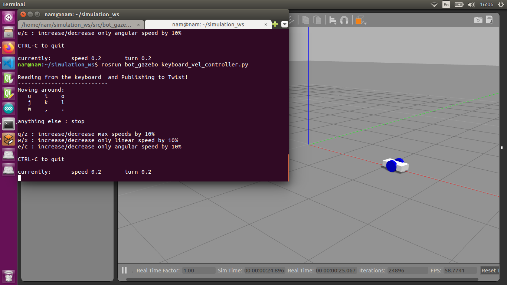

# mybot Gazebo
Simple Mobile robot and simulate on Gazebo
## Download and Install 
```
$ cd [your ws]/src
$ git clone https://github.com/DuyNamUET/bot_gazebo.git
$ cd ..
$ catkin_make
```
## Run 
Use Gazebo to simulate simple mobile robot
```
$ roslaunch bot_gazebo gazebo.launch
```
Use keyboard to control mobile robot. In another terminal:
```
$ rosrun bot_gazebo keyboard_vel_controller.py
```
## Result
